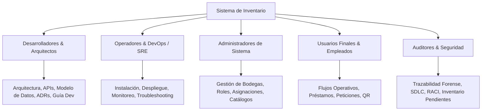

# Índice Maestro de Documentación del Sistema

Bienvenido al repositorio central de documentación del **Sistema de Inventario (Elite Nutrition / FutuPro)**.
Este índice maestro clasifica y organiza la totalidad de los documentos técnicos, operativos y funcionales del proyecto según el perfil y la necesidad del lector.

---

## 1. Clasificación por Perfil y Audiencia



---

### 1.1 Para Desarrolladores e Ingenieros de Software
Documentación técnica profunda para comprender la base de código, diseñar nuevas funciones y mantener la calidad del software:
* **[Guía para Desarrolladores (Onboarding y Estándares)](tecnica/README_devs.md):** Requisitos de entorno local, estándares de código (FastAPI / React), convenciones de commits y flujos de trabajo.
* **[Arquitectura Global del Sistema](tecnica/arquitectura.md):** Diagrama C4, visión general de componentes y topología de red.
* **[Arquitectura Interna del Backend](tecnica/arquitectura_backend.md):** Estructura modular de routers, inyección de dependencias (`Depends`), servicios y middlewares.
* **[Arquitectura Interna del Frontend](tecnica/arquitectura_frontend.md):** Estado global con React Contexts (`moduleContext`, `warehouseContext`), router, llamadas a API y componentes.
* **[Especificación de APIs y Contratos REST](tecnica/api_contratos.md):** Contratos completos de endpoints, schemas de solicitud/respuesta, códigos HTTP y permisos.
* **[Diccionario del Modelo de Datos Relacional](modelo_datos.md):** Entidad-Relación (ERD), tablas, campos, llaves foráneas, enums y restricciones.
* **[Registro de Decisiones Arquitectónicas (ADRs)](tecnica/decisiones_arquitectura_adr.md):** Contexto, alternativas y justificación de decisiones clave de diseño (tokens en BD vs JWT, almacenamiento de fotos, etc.).
* **[Guía de Pruebas Automatizadas y Calidad](tecnica/guia_pruebas.md):** Ejecución de tests en Pytest (backend) y Vitest (frontend), fixtures en memoria y quality gates.
* **[Registro de Cambios (Changelog)](tecnica/CHANGELOG.md):** Historial estructurado de versiones y mutaciones de código según Semantic Versioning.

---

### 1.2 Para Operadores, SysAdmins y DevOps / SRE
Documentación para el aprovisionamiento, despliegue, monitoreo continuo y recuperación de desastres:
* **[Guía de Instalación y Configuración Local](instalacion_configuracion.md):** Dependencias de entorno (`Node.js`, `Python`), variables de entorno (`.env`) y arranque inicial.
* **[Despliegue y Entorno de Producción](tecnica/despliegue_y_entorno.md):** Pipelines CI/CD automatizados en Vercel (Frontend) y Render (Backend).
* **[Manual de Operación, Monitoreo y Mantenimiento](tecnica/manual_operacion_monitoreo.md):** Endpoints de healthcheck, monitoreo de pools de conexión, copias de seguridad (backups con `pg_dump`), rotación de credenciales y planes de rollback.
* **[Guía de Resolución de Problemas (Troubleshooting)](tecnica/guia_troubleshooting.md):** Diagnóstico paso a paso para incidencias de CORS, errores `401/403/429`, problemas de cuota en Google Gemini, fallos de cámara QR y reparación de inconsistencias de activos.

---

### 1.3 Para Administradores del Sistema
Directrices sobre la configuración operativa, permisos y gobernanza del inventario:
* **[Manual de Roles y Permisos](usabilidad/manual_roles_permisos.md):** Matriz de responsabilidades entre Admin Maestro, Admin de Bodega, Encargado, Portería/Salida y Empleado.
* **[Gestión Multi-Bodega y Módulos](tecnica/api_contratos.md#3-módulo-de-bodegas-y-módulos-warehouses):** Reglas de aislamiento territorial entre sedes (Elite, FutuPro, etc.) y asignación de usuarios.
* **[Catálogo de Pantallas del Sistema](usabilidad/catalogo_pantallas.md):** Inventario de vistas administrativas, contabilidad/depreciación, activos ociosos y gestión de usuarios.

---

### 1.4 Para Usuarios Finales y Empleados Operativos
Manuales funcionales para la operación diaria sin requerir conocimientos técnicos:
* **[Flujos Operativos Paso a Paso](usabilidad/flujos_operativos.md):** Cómo solicitar un equipo, firmar el pase de salida en portería, aceptar una asignación fija o formalizar una devolución.
* **[Escaneo y Búsqueda de Activos](usabilidad/catalogo_pantallas.md):** Uso del lector de código QR en móvil o pistola de código de barras.

---

### 1.5 Para Auditores, Compliance y Seguridad
Evidencia sobre el cumplimiento de normas de seguridad, inmutabilidad y control de calidad:
* **[Auditoría, Control y Seguridad](flujos/auditoria_y_seguridad.md):** Registro forense en `activity_logs`, hash criptográfico de contraseñas con bcrypt y salvaguardas de desarrollo asistido por IA.
* **[Ciclo de Vida del Software (SDLC)](flujos/SDLC.md):** Procesos de integración continua, revisión por pares y despliegue a producción.
* **[Matriz RACI](flujos/matriz_raci.md):** Asignación formal de roles (Responsable, Aprobador, Consultado, Informado) en eventos críticos de ingeniería y negocio.
* **[Inventario de Pendientes y Limitaciones Técnicas](tecnica/inventario_documentacion_pendiente.md):** Puntos marcados como *pendiente de verificación*, restricciones conocidas y deudas técnicas identificadas.
* **[Informe Técnico y Dictamen Forense de Auditoría](tecnica/informe_tecnico_auditoria_respuestas.md):** Dictamen oficial frente a pruebas de estrés y matriz de respuestas a los 15 hallazgos de testing externo.

---

## 2. Mapa Completo de Archivos del Repositorio

```
docs/
├── INDICE_MAESTRO.md                         # Este documento (Índice Central)
├── instalacion_configuracion.md              # Requisitos y variables de entorno
├── modelo_datos.md                           # Diagrama ERD y catálogo de tablas SQL
├── flujos/
│   ├── SDLC.md                               # Ciclo de vida del software
│   ├── auditoria_y_seguridad.md              # Controles de seguridad y bitácoras
│   └── matriz_raci.md                        # Matriz de responsabilidades organizacionales
├── tecnica/
│   ├── README_devs.md                        # Guía de contribución para desarrolladores
│   ├── api_contratos.md                      # Especificación REST de todos los endpoints
│   ├── arquitectura.md                       # Arquitectura global y diagrama C4
│   ├── arquitectura_backend.md               # Detalles internos del backend FastAPI
│   ├── arquitectura_frontend.md              # Detalles internos del frontend React
│   ├── decisiones_arquitectura_adr.md        # Registro histórico de ADRs
│   ├── despliegue_y_entorno.md               # CI/CD y despliegue en Vercel/Render
│   ├── guia_pruebas.md                       # Suites de testing backend/frontend
│   ├── manual_operacion_monitoreo.md         # Operación diaria, backups y healthchecks
│   ├── guia_troubleshooting.md               # Resolución de incidentes y fallos comunes
│   ├── CHANGELOG.md                          # Registro formal de versiones y cambios
│   ├── inventario_documentacion_pendiente.md # Limitaciones y pendientes de verificación
│   └── informe_tecnico_auditoria_respuestas.md # Dictamen de auditoría y respuesta a los 15 puntos
└── usabilidad/
    ├── catalogo_pantallas.md                 # Detalle de pantallas y controles de UI
    ├── flujos_operativos.md                  # Procedimientos funcionales paso a paso
    └── manual_roles_permisos.md              # Matriz de permisos y accesos por cargo
```
