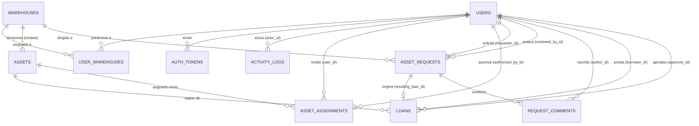

# Diccionario del Modelo de Datos Relacional

Este documento es la referencia técnica formal del esquema de base de datos relacional del **Sistema de Inventario**, modelado mediante SQLAlchemy en `backend/models.py`.

---

## 1. Diagrama Entidad-Relación (ERD)

---

## 2. Tipos Enumerados (Enums)

| Enum | Valores Permitidos | Descripción |
| :--- | :--- | :--- |
| `RoleEnum` | `'admin'`, `'encargado'`, `'salida'`, `'empleado'` | Jerarquía de autorización en la plataforma. |
| `AssetStatusEnum` | `'available'`, `'loaned'`, `'maintenance'`, `'assigned'`, `'pending_registration'` | Ciclo de vida y estado físico del activo. |
| `AssignmentStatusEnum`| `'active'`, `'expired'`, `'revoked'` | Estado de vigencia de una asignación a largo plazo. |
| `LoanStatusEnum` | `'pending'`, `'approved'`, `'rejected'`, `'checked_out'`, `'returned'` | Máquina de estados de un préstamo. |
| `RequestStatusEnum` | `'pending'`, `'assigned'`, `'rejected'` | Estado del ticket de solicitud PQR. |
| `CategoryEnum` | `'computadores'`, `'celulares'`, `'tablets'`, `'camaras'`, `'microfonos'`, `'audio'`, `'tripodes'`, `'telefono'`, `'impresoras'`, `'proyectores'`, `'cables'`, `'otros'` | Clasificación física y contable del activo. |
| `InventoryTypeEnum` | `'activos'`, `'publicitario'`, `'muebles'` | Naturaleza del inventario corporativo. |
| `ValueSourceEnum` | `'manual'`, `'estimado'`, `'desconocido'` | Origen del valor monetario asignado al activo. |

---

## 3. Especificación de Tablas y Atributos

### 3.1 `warehouses` (Bodegas y Módulos)
Ubicaciones lógicas y físicas administrables en tiempo de ejecución.

| Columna | Tipo | Nulo | Default | Restricciones | Descripción |
| :--- | :--- | :--- | :--- | :--- | :--- |
| `id` | `Integer` | No | Auto | PK, Index | Identificador interno secuencial. |
| `key` | `String` | No | - | Unique, Index | Slug identificador inmutable (ej. `elite`, `futupro`). |
| `name` | `String` | No | - | - | Etiqueta descriptiva editable. |
| `is_active` | `Boolean` | No | `True` | - | Bandera para deshabilitar bodegas inactivas. |
| `created_at` | `DateTime` | No | `UTC` | - | Fecha de alta de la bodega. |

---

### 3.2 `user_warehouses` (Tabla Puente)
Relación muchos-a-muchos entre usuarios y bodegas asignadas.

| Columna | Tipo | Nulo | Restricciones | Descripción |
| :--- | :--- | :--- | :--- | :--- |
| `user_id` | `Integer` | No | PK, FK -> `users.id` (ON DELETE CASCADE) | ID del usuario. |
| `warehouse_id`| `Integer` | No | PK, FK -> `warehouses.id` (ON DELETE CASCADE) | ID de la bodega autorizada. |

---

### 3.3 `users` (Usuarios y Colaboradores)
Cuentas de acceso, credenciales y perfiles laborales.

| Columna | Tipo | Nulo | Restricciones | Descripción |
| :--- | :--- | :--- | :--- | :--- |
| `id` | `Integer` | No | PK, Index | Identificador del usuario. |
| `username` | `String` | No | Unique, Index | Nombre de usuario generado automáticamente en formato slug. |
| `full_name` | `String` | No | - | Nombres y apellidos completos. |
| `email` | `String` | Sí | Unique, Index | Correo electrónico de acceso. |
| `document_id` | `String` | No | Unique, Index | Cédula de ciudadanía o documento de identidad. |
| `photo_url` | `String` | Sí | - | URL de la foto de perfil en Supabase Storage. |
| `additional_photos` | `JSON` | Sí | Default `[]` | Lista de URLs adicionales de soporte. |
| `digital_signature_url`| `String`| Sí | - | URL segura de la firma digital vectorizada. |
| `role` | `Enum(RoleEnum)`| No | Default `empleado` | Rol de seguridad. |
| `cargo` | `String` | Sí | Index | Denominación del cargo laboral. |
| `password_hash` | `String` | Sí | - | Hash Bcrypt de la contraseña. |

---

### 3.4 `assets` (Catálogo Maestro de Activos)
Inventario físico de equipos y materiales.

| Columna | Tipo | Nulo | Restricciones | Descripción |
| :--- | :--- | :--- | :--- | :--- |
| `id` | `Integer` | No | PK, Index | Identificador del activo. |
| `unique_code` | `String` | No | Unique, Index | Código de barras o QR físico (ej. `ELITE-0012`). |
| `description` | `String` | Sí | - | Descripción del elemento. |
| `brand_model` | `String` | Sí | - | Marca y modelo específico. |
| `photo_url` | `String` | Sí | - | URL de la fotografía principal en Supabase. |
| `additional_photos` | `JSON` | Sí | Default `[]` | Fotografías complementarias de estado físico. |
| `status` | `Enum(AssetStatusEnum)` | No | Default `available` | Estado operativo del activo. |
| `qr_data` | `String` | Sí | Unique, Index | Representación en Base64 del código QR generado. |
| `module` | `String` | No | FK -> `warehouses.key`, Index | Bodega a la que pertenece el equipo. |
| `area` | `String` | Sí | - | Dependencia interna (ej. 'Producción', 'Gerencia'). |
| `responsible_name` | `String` | Sí | - | Nombre del custodio actual denormalizado. |
| `value` | `Float` | Sí | - | Valor histórico importado. |
| `accessories` | `JSON` | Sí | Default `[]` | Lista de accesorios incluidos (`[{name, is_linked_asset, linked_asset_code}]`). |
| `observations` | `Text` | Sí | - | Notas técnicas o historial de novedades. |
| `inventory_type` | `Enum(InventoryTypeEnum)` | No | Default `activos`, Index | Tipo de inventario. |
| `category` | `Enum(CategoryEnum)` | Sí | Index | Categoría contable/operativa. |
| `purchase_price` | `Float` | Sí | - | Precio de adquisición en COP. |
| `purchase_date` | `DateTime` | Sí | - | Fecha de compra para cálculo de depreciación. |
| `estimated_value` | `Float` | Sí | - | Valor estimado por IA o tasación. |
| `value_source` | `Enum(ValueSourceEnum)` | No | Default `desconocido` | Fuente de la valoración. |

---

### 3.5 `loans` (Transacciones de Préstamos)
Préstamos temporales de activos con flujo de aprobación y pase de salida.

| Columna | Tipo | Nulo | Restricciones | Descripción |
| :--- | :--- | :--- | :--- | :--- |
| `id` | `Integer` | No | PK, Index | Identificador del préstamo. |
| `asset_id` | `Integer` | No | FK -> `assets.id` | Activo prestado. |
| `borrower_id` | `Integer` | No | FK -> `users.id` | Empleado solicitante. |
| `approver_id` | `Integer` | Sí | FK -> `users.id` | Encargado o Admin que aprobó. |
| `reason` | `Text` | Sí | - | Motivo justificado del préstamo. |
| `status` | `Enum(LoanStatusEnum)` | No | Default `pending` | Estado del préstamo. |
| `borrowed_accessories` | `JSON` | Sí | Default `[]` | Lista de accesorios entregados al momento de la salida. |
| `request_date` | `DateTime` | No | Default `UTC` | Fecha de radicación. |
| `approval_date` | `DateTime` | Sí | - | Fecha en que fue aprobado. |
| `checkout_date` | `DateTime` | Sí | - | Fecha de entrega física del activo. |
| `return_date` | `DateTime` | Sí | - | Fecha de recepción en bodega. |
| `observations` | `Text` | Sí | - | Anotaciones de entrega y devolución. |
| `condition_status` | `String` | Sí | - | Estado físico al devolver ('BUENO', 'DAÑADO', etc.). |
| `security_authorization`| `String`| Sí | - | 'AUTORIZADO_SALIDA' o 'USO_INTERNO'. |
| `security_signature_url`| `String`| Sí | - | Firma del guardia en portería de Pentágono. |

---

### 3.6 `asset_assignments` (Asignaciones Fijas)
Asignaciones corporativas de largo plazo con control de renovación periódica.

| Columna | Tipo | Nulo | Restricciones | Descripción |
| :--- | :--- | :--- | :--- | :--- |
| `id` | `Integer` | No | PK, Index | Identificador de la asignación. |
| `asset_id` | `Integer` | No | FK -> `assets.id` | Activo asignado. |
| `user_id` | `Integer` | No | FK -> `users.id` | Colaborador custodio. |
| `authorized_by_id` | `Integer` | Sí | FK -> `users.id` | Líder o Admin que autorizó. |
| `start_date` | `DateTime` | No | Default `UTC` | Inicio de vigencia. |
| `expiration_date` | `DateTime` | No | - | Fecha límite que exige renovación. |
| `status` | `Enum(AssignmentStatusEnum)`| No | Default `active` | Estado de la asignación. |
| `notes` | `Text` | Sí | - | Notas de asignación. |
| `security_authorization` | `String` | Sí | - | Autorización para portar el activo fuera de sede. |
| `is_accepted` | `Boolean` | No | Default `False` | Confirmación formal del empleado. |

---

### 3.7 `asset_requests` (Solicitudes / Tickets PQR)
Tickets en los que un colaborador solicita un requerimiento sin conocer el ID del activo.

| Columna | Tipo | Nulo | Restricciones | Descripción |
| :--- | :--- | :--- | :--- | :--- |
| `id` | `Integer` | No | PK, Index | Identificador del ticket. |
| `requester_id` | `Integer` | No | FK -> `users.id` | Usuario que solicita. |
| `module` | `String` | Sí | FK -> `warehouses.key` | Bodega de atención. |
| `category_requested` | `Enum(CategoryEnum)` | Sí | - | Tipo de equipo pedido. |
| `description` | `Text` | No | - | Justificación de la necesidad. |
| `status` | `Enum(RequestStatusEnum)` | No | Default `pending` | Estado del requerimiento. |
| `reviewed_by_id` | `Integer` | Sí | FK -> `users.id` | Encargado que atendió. |
| `resulting_loan_id` | `Integer` | Sí | FK -> `loans.id` | Préstamo generado al asignar un equipo. |
| `created_at` | `DateTime` | No | Default `UTC` | Fecha de creación. |
| `reviewed_at` | `DateTime` | Sí | - | Fecha de resolución. |
| `review_notes` | `Text` | Sí | - | Respuesta formal del encargado. |

---

### 3.8 `request_comments` (Mensajería de Tickets)
Comentarios bidireccionales en el hilo de una solicitud.

| Columna | Tipo | Nulo | Restricciones | Descripción |
| :--- | :--- | :--- | :--- | :--- |
| `id` | `Integer` | No | PK, Index | Identificador del comentario. |
| `asset_request_id` | `Integer` | No | FK -> `asset_requests.id` | Solicitud asociada. |
| `author_id` | `Integer` | No | FK -> `users.id` | Autor del mensaje. |
| `message` | `Text` | No | - | Contenido del mensaje. |
| `created_at` | `DateTime` | No | Default `UTC` | Timestamp de envío. |

---

### 3.9 `activity_logs` (Bitácora Inmutable de Auditoría)
Registro forense de cada mutación relevante ocurrida en el sistema.

| Columna | Tipo | Nulo | Restricciones | Descripción |
| :--- | :--- | :--- | :--- | :--- |
| `id` | `Integer` | No | PK, Index | Identificador del log. |
| `actor_id` | `Integer` | Sí | FK -> `users.id` | Usuario que ejecutó la acción (NULL si fue eliminado). |
| `action` | `String` | No | Index | Código de acción (ej. `asset.created`, `loan.approved`). |
| `description` | `Text` | No | - | Detalle explicativo de la operación. |
| `entity_type` | `String` | Sí | Index | Entidad impactada (`asset`, `loan`, `user`, etc.). |
| `entity_id` | `Integer` | Sí | - | Clave primaria de la entidad impactada. |
| `created_at` | `DateTime` | No | Default `UTC`, Index | Timestamp inmutable del suceso. |

---

### 3.10 `auth_tokens` (Sesiones Revocables)
Tokens criptográficos opacos para validación de sesiones con estado en base de datos.

| Columna | Tipo | Nulo | Restricciones | Descripción |
| :--- | :--- | :--- | :--- | :--- |
| `id` | `Integer` | No | PK, Index | Identificador interno. |
| `user_id` | `Integer` | No | FK -> `users.id` | Propietario de la sesión. |
| `token` | `String` | No | Unique, Index | Hash SHA-256 del token emitido. |
| `created_at` | `DateTime` | No | Default `UTC` | Momento de emisión. |
| `expires_at` | `DateTime` | No | - | Fecha de caducidad automática (30 días). |

---

### 3.11 `role_permissions` (Matriz de Políticas por Cargo)
Reglas de negocio que definen qué categorías puede solicitar un cargo determinado.

| Columna | Tipo | Nulo | Restricciones | Descripción |
| :--- | :--- | :--- | :--- | :--- |
| `id` | `Integer` | No | PK, Index | Identificador de la regla. |
| `cargo` | `String` | No | Unique, Index | Nombre normalizado del cargo laboral. |
| `allowed_categories` | `Text` | No | - | Lista de valores de `CategoryEnum` separados por coma. |
