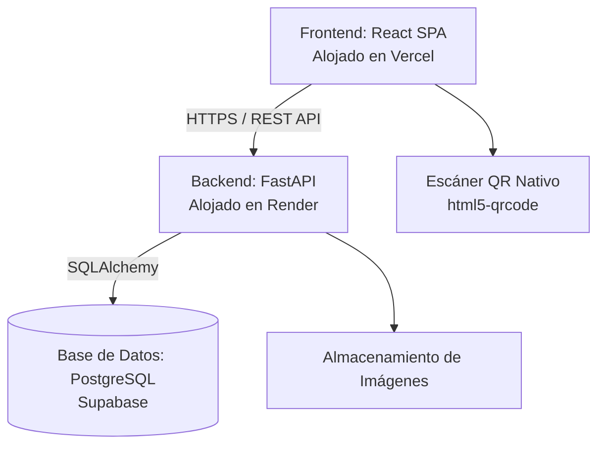

# Arquitectura y Modelo de Datos del Sistema de Inventario

## 1. Propósito y Alcance del Sistema
El Sistema de Inventario es una plataforma web (SPA) diseñada para gestionar el ciclo de vida de los activos de la empresa (registro, asignación, préstamo, mantenimiento y auditoría). Facilita el control de inventario físico, préstamos de equipos mediante un flujo de aprobación, seguimiento de actividad, e integración con códigos QR para auditorías rápidas.

## 2. Arquitectura General
El sistema sigue un patrón de arquitectura **Cliente-Servidor (SPA + API REST)**.

- **Frontend:** Single Page Application construida con React y Vite. Utiliza Tailwind CSS para estilos. Está alojada de manera estática y su estado interno maneja la sesión (mediante LocalStorage) y la navegación (React Router).
- **Backend:** API REST construida con FastAPI (Python). Proporciona los servicios de negocio, autenticación, y exposición de datos. Se despliega en Render.
- **Base de Datos:** PostgreSQL administrado por Supabase. Se interactúa a través de SQLAlchemy (ORM) de forma síncrona.

### Diagrama de Arquitectura de Alto Nivel

## 3. Modelo de Datos (Esquema Relacional)

La base de datos relacional modela el inventario, los usuarios y las transacciones. Las tablas principales son:

### 3.1. `users`
Almacena credenciales y roles.
- **Roles:** `ADMIN`, `ENCARGADO`, `SALIDA`, `EMPLEADO`.
- **Campos Clave:** `username`, `password_hash`, `role`.

### 3.2. `assets`
Catálogo maestro del inventario físico.
- **Campos Clave:** `unique_code` (ej. Código QR), `status`, `module`, `inventory_type`, `category`.
- **Estados:** `AVAILABLE`, `LOANED`, `MAINTENANCE`, `ASSIGNED`, `PENDING_REGISTRATION`.

### 3.3. `loans` (Préstamos)
Registra eventos puntuales donde un activo se cede temporalmente a un usuario.
- **Campos Clave:** `asset_id`, `borrower_id`, `approver_id`, `status`.
- **Fechas:** `request_date`, `approval_date`, `checkout_date`, `return_date`.

### 3.4. `asset_assignments` (Asignaciones)
Asignación a largo plazo de un activo a un usuario (ej. Computador asignado a un empleado por su cargo).
- **Campos Clave:** `start_date`, `expiration_date`, `status`.

### 3.5. `asset_requests` y `request_comments`
Permite a los empleados crear peticiones de equipos sin escoger un ID de inventario específico. El administrador atiende el ticket (`asset_request`) respondiendo con mensajes (`request_comments`) y convirtiéndolo en un `loan` asignando un `asset` real.

### 3.6. `activity_logs`
Bitácora de auditoría inmutable que registra quién (`actor_id`) hizo qué (`action`) sobre qué recurso (`entity_type`, `entity_id`). Utilizado para rastreabilidad de los movimientos de inventario.

## 4. Decisiones Arquitectónicas (ADRs Implícitos)
- **Timezones (Hora Local):** A nivel de base de datos se maneja hora local (`get_colombia_time()`) como convención interna de negocio en lugar de UTC generalizado, debido a la naturaleza regional del aplicativo.
- **Autenticación (Sin JWT):** Se optó por tokens de base de datos (`AuthToken`) generados mediante SHA256 y validados contra PostgreSQL en cada petición, permitiendo revocación inmediata y manejo simplificado de expiraciones.
- **Autorización por Roles:** El acceso a los endpoints y a la UI está firmemente condicionado por decoradores/guards orientados a `RoleEnum`.

*Última actualización: Septiembre 2026.*
