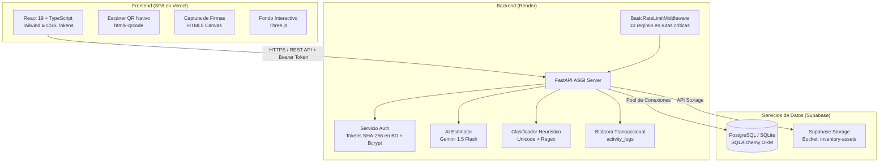

# Arquitectura Global del Sistema de Inventario

## 1. Propósito y Alcance del Sistema
El **Sistema de Inventario** es una plataforma web (SPA + REST API) diseñada para gestionar integralmente el ciclo de vida de los activos corporativos de Elite Nutrition y Futuro Pro (registro, valorización, asignación, préstamo, mantenimiento, pase de salida y auditoría). Facilita el control de inventario físico, préstamos de equipos mediante un flujo de aprobación de doble vía, seguimiento de custodios, integración con códigos QR para auditorías rápidas y avalúo asistido por inteligencia artificial multimodal.

---

## 2. Arquitectura General del Sistema

El sistema sigue un patrón desacoplado de **Cliente-Servidor (SPA + API REST)**:

- **Frontend:** Single Page Application desarrollada con **React 19**, **TypeScript** y **Vite**. La navegación es orquestada por `react-router-dom` v7 y el estado de sesión y bodega activa se preserva en `localStorage` mediante contextos reactivos. Alojada estáticamente en **Vercel**.
- **Backend:** API REST construida con **FastAPI** y **Python 3**. Estructurada en routers modulares por dominio de negocio (`routes/`), validación con **Pydantic** y persistencia ORM mediante **SQLAlchemy**. Alojada en **Render** (servidor ASGI Uvicorn).
- **Base de Datos:** Motor relacional **PostgreSQL** administrado por **Supabase** (con soporte en desarrollo local para SQLite).
- **Almacenamiento de Archivos:** **Supabase Storage** (bucket `inventory-assets`) para alojar fotografías de activos, evidencias físicas y firmas digitales vectorizadas.
- **Inteligencia Artificial:** Integración con **Google Gemini 1.5 Flash** para estimación automática de avalúo y categorización de activos a partir de fotos.

### Diagrama de Arquitectura de Alto Nivel

```mermaid
graph TD
    subgraph Cliente ["Frontend (SPA en Vercel)"]
        UI[React 19 + TypeScript\nTailwind & CSS Tokens]
        QRScanner[Escáner QR Nativo\nhtml5-qrcode]
        CanvasSig[Captura de Firmas\nHTML5 Canvas]
        ThreeBG[Fondo Interactivo\nThree.js]
    end

    subgraph BackendApp ["Backend (Render)"]
        API[FastAPI ASGI Server]
        RateLimit[BasicRateLimitMiddleware\n10 req/min en rutas críticas]
        AuthSvc[Servicio Auth\nTokens SHA-256 en BD + Bcrypt]
        AISvc[AI Estimator\nGemini 1.5 Flash]
        ClassSvc[Clasificador Heurístico\nUnicode + Regex]
        AuditSvc[Bitácora Transaccional\nactivity_logs]
    end

    subgraph Persistencia ["Servicios de Datos (Supabase)"]
        DB[(PostgreSQL / SQLite\nSQLAlchemy ORM)]
        Storage[Supabase Storage\nBucket: inventory-assets]
    end

    UI -->|HTTPS / REST API + Bearer Token| API
    RateLimit --> API
    API --> AuthSvc
    API --> AISvc
    API --> ClassSvc
    API --> AuditSvc
    API -->|Pool de Conexiones| DB
    API -->|API Storage| Storage
```

---

## 3. Modelo de Capas y Dominios de Negocio

El sistema organiza sus responsabilidades en dominios desacoplados:

### 3.1 Gestión de Bodegas y Tenencia Lógica (`warehouses`)
Soporta múltiples centros de operación físicos (`elite`, `futupro`, etc.). El acceso de los usuarios administradores se valida dinámicamente mediante la relación `user_warehouses`.

### 3.2 Catálogo Maestro de Activos (`assets`)
Registra cada bien con su código identificador único (`unique_code`), código QR Base64 autogenerado, fotos, lista de accesorios y estado operativo (`available`, `loaned`, `maintenance`, `assigned`, `pending_registration`).

### 3.3 Ciclo de Préstamos Temporales (`loans`)
Modela transacciones de uso a corto plazo. Incluye radicación por el empleado (`pending`), aprobación por encargado (`approved`), pase de salida por seguridad en portería con firma manuscrita (`checked_out`) y retorno a almacén con verificación de estado (`returned`).

### 3.4 Asignaciones Fijas Corporativas (`asset_assignments`)
Modela equipos de dotación personal de largo plazo. Poseen fecha límite de expiración, renovación programada y acta formal de aceptación firmada por el colaborador.

### 3.5 Tickets de Solicitud de Equipos (`asset_requests`)
Flujo de requerimiento donde los empleados expresan una necesidad genérica de equipo. El encargado evalúa el requerimiento, interactúa en un hilo de comentarios bidireccional y, al aprobarlo, asocia un activo disponible convirtiéndolo en un préstamo formal.

### 3.6 Auditoría Forense Continua (`activity_logs`)
Bitácora transaccional inmutable que graba cada inserción, modificación o eliminación con fecha en UTC, autor del cambio, tipo de entidad e identificador.

---

## 4. Decisiones Arquitectónicas Fundamentales

1. **Tokens Opacos con Estado en BD:** Eliminación de vulnerabilidades de revocación en JWT mediante almacenamiento de hashes SHA-256 en `auth_tokens`.
2. **Timestamps en UTC Unificado:** Persistencia estandarizada en UTC en base de datos (`time_util.py`), delegando el formateo regional (`America/Bogota`) a la vista.
3. **Scoping de Doble Capa:** Combinación de roles jerárquicos (RBAC) y filtrado horizontal por bodegas (`module.in_(allowed)`).
4. **Protección perimetral:** Rate limiting en memoria para prevenir ataques de diccionario y agotamiento de tokens en la API de Google Gemini.
